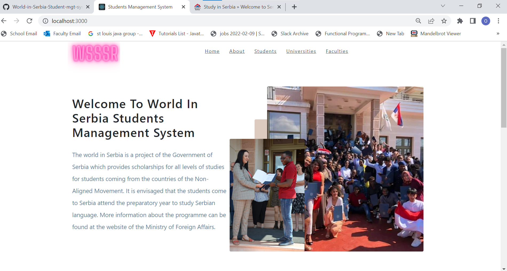
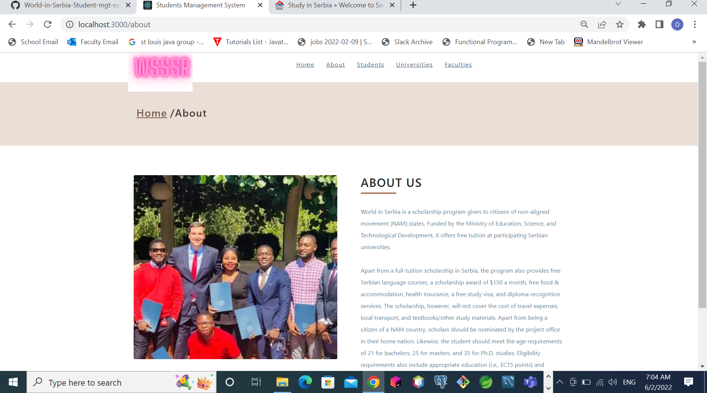

# WORLD IN SERBIA STUDENT MANAGEMENT SYSTEM

This is a project work for the course title: SOFTWARE TESTING AND QUALITY on Master studies 
submitted to the Department of Software Engineering and Computer Science,
Faculty of Organisational Sciences, UNIVERSITY OF BELGRADE, SERBIA. 

It is A PROJECT WORK fully implemented as a SpringBoot-React-js web 
application created with java 11, springboot-2 and spring framework-5 and postgreSQL 
Database in the backend and React-js open source framework at the front end

# TABLE OF CONTENTS

. General info

. Technologies

. Detailed information

# General info

World in Serbia Management System is an application in which every scholar or aspiring 
scholars can access information about list of universities and ranking and can find list 
of faculties and associated universities with their locations and address in order to 
enable them go about making the right choice of institutions for their studies.

# TECHNOLOGIES

Project is created with:

. Java 11;

. SpringBoot-2; 

. spring framework-5;

. React-js(frontend); 

. postgresSQL 42.0.29 database.

# Testing Frameworks

Mockito and JUnit frameworks

# Detailed description of the application

#DATABASE - CONNECTION PARAMETERS

I use postgreSQL, for data storage and manipulation,

I have created a database "mokitoDB", and you can find the connection in the "application.properties"

String url = "jdbc:mySQL://localhost:5432/mokitoDB";

String user = "postgres";

String password = "postgres";

I used postgres pgAdmin to run a postgres Server on my localhost.

# STARTING THE APPLICATION:

To start the application backend, right-click on the softwareTestingProjectApplication 
Class and then select the Run 'Application.Main()' and the backend will be started on 
tomcat port 8080, then zou will need to start the frontend in order to access the web page. 
You can find the appearance of the Home page and About page below. 

LICENSE

COPYRIGHT © 2022 ORBANJAMES.
